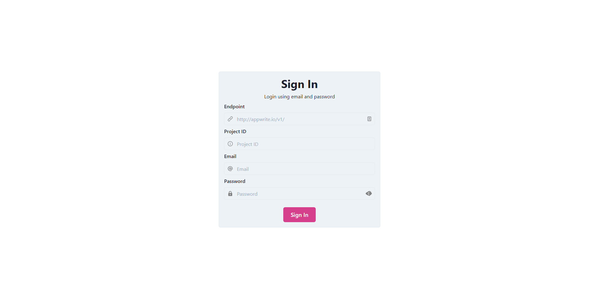
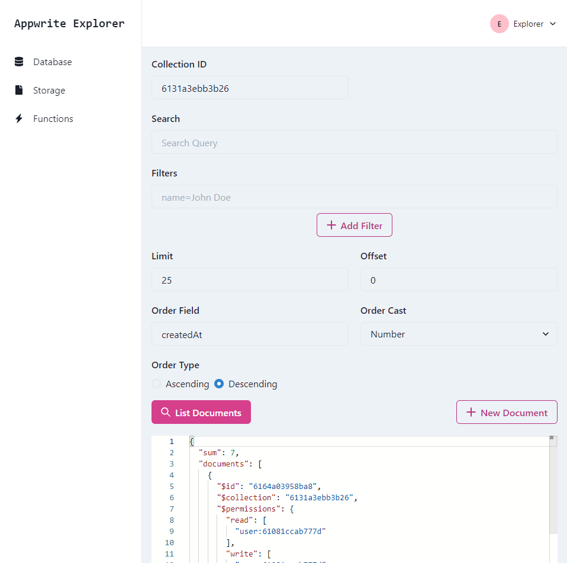
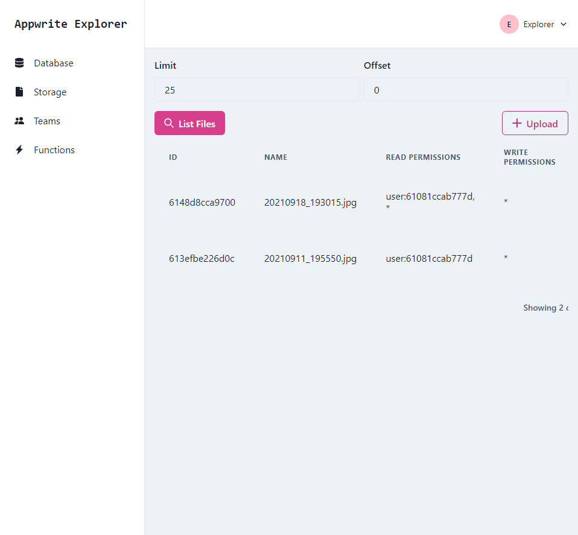
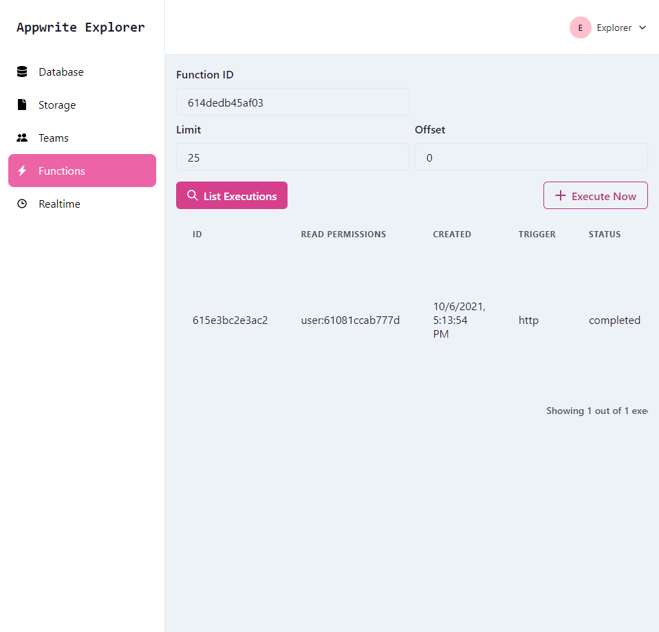
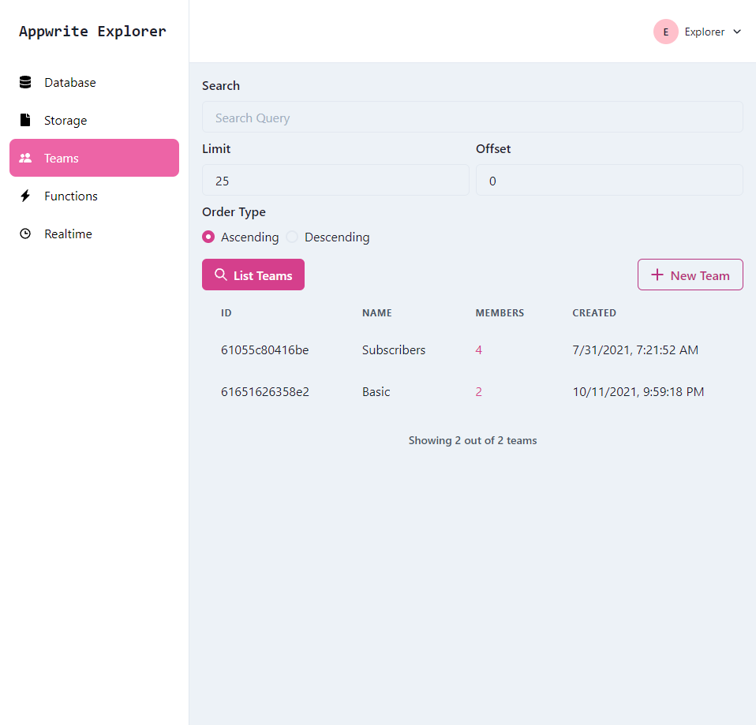
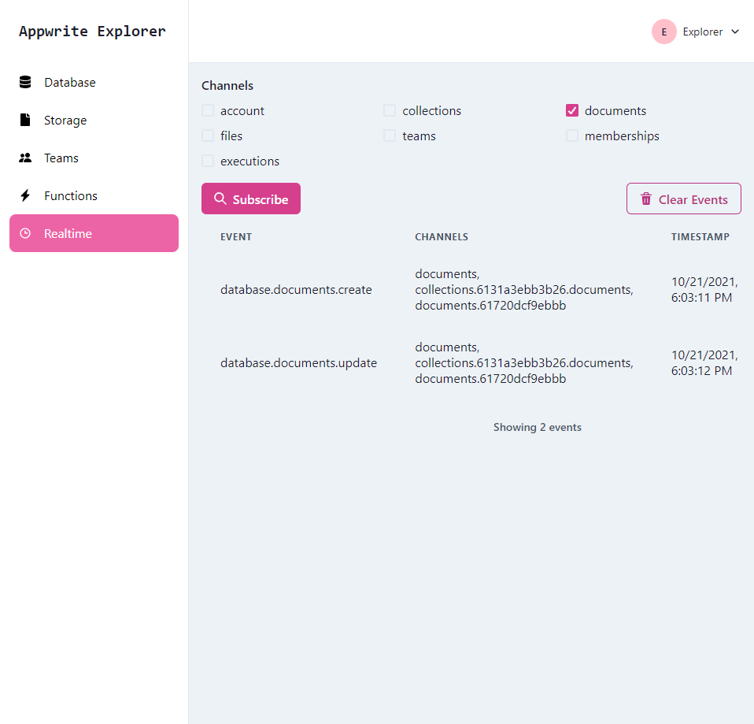

# Appwrite Explorer

**This app is best used with Appwrite version 0.15.X.**

Appwrite Explorer is a tool that let's you explore different aspects of an [Appwrite](https://appwrite.io) project from the front end.

## Features

### Account



- [x] Sign in with Email and Password
- [x] Guest Access
- [ ] Anonymous Access
- [ ] Sign in with Magic URL
- [ ] OAuth2 Authentication
- [x] Update Account Name
- [ ] Update Account Password
- [ ] Update Account Email
- [ ] Update Account Preferences
- [ ] Email Verification
- [ ] Password Reset

## Database



- [x] Create Document
- [x] List Documents
- [ ] Update Document
- [x] Filter Documents List
- [x] Search Documents
- [ ] Delete Document

## Storage



- [x] Create File
- [x] List Files
- [ ] Create File with Permissions
- [ ] Download File
- [ ] Search Files
- [ ] Update File
- [ ] Delete File

## Functions



- [x] List Executions
- [x] Create Execution

## Teams



- [x] List Teams
- [x] Create Team
- [ ] Update Team
- [ ] Delete Team
- [x] Create Team Membership
- [ ] Update Team Membership
- [ ] Update Membershp Roles
- [ ] Delete Team Membership

### Realtime



- [x] Basic Subscribe
- [ ] Add support for ID based channels

## Getting Started

Appwrite Explorer is best run locally using Docker.

### Prerequisites

- Docker

### Running

Start the container:

```bash
docker run --rm -p 8080:80 stnguyen90/appwrite-explorer
```

Then, browse to [http://localhost:8080](http://localhost:8080).
