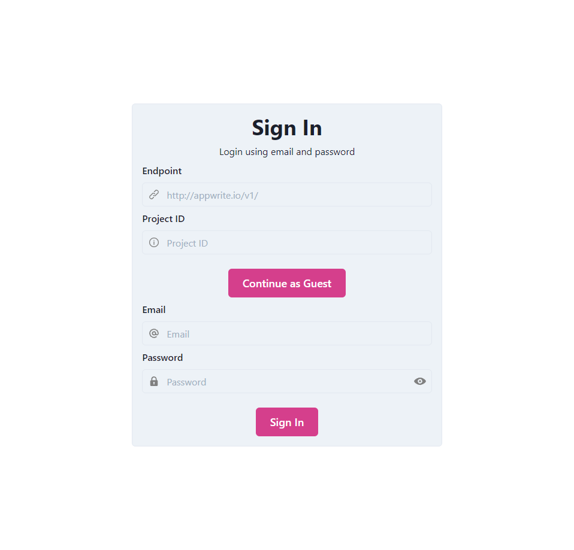
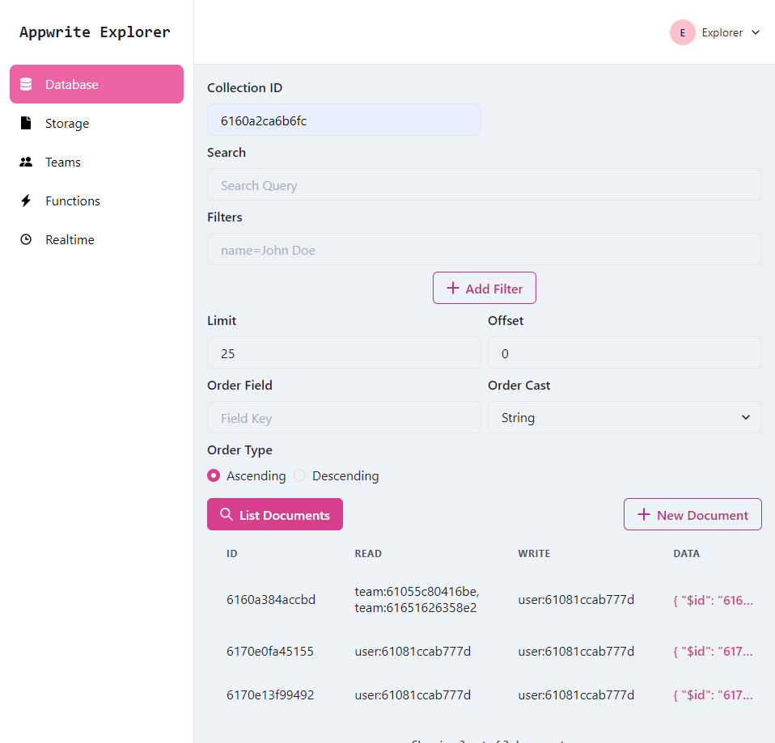
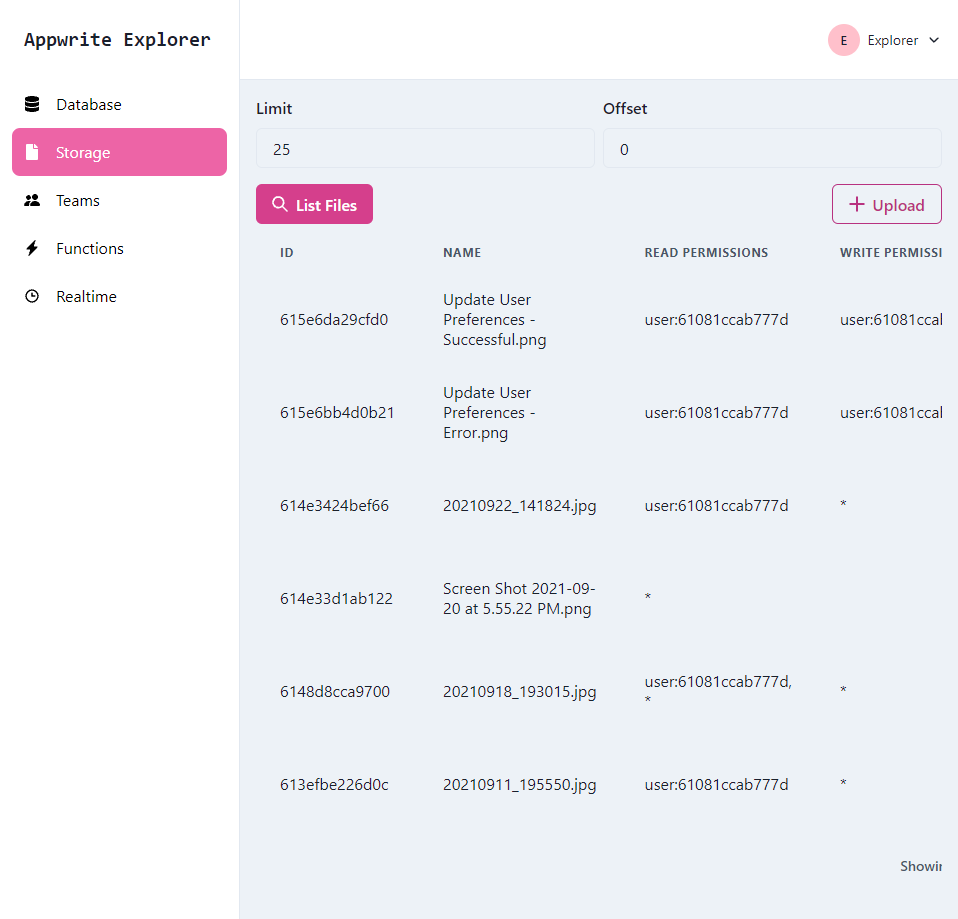

# Appwrite Explorer

Appwrite Explorer is a tool that let's you explore different aspects of an [Appwrite](https://appwrite.io) project from the front end.

## Features

### Account



- [x] Sign in with Email and Password
- [x] Guest Access
- [ ] Anonymous Access
- [ ] Sign in with Magic URL
- [ ] OAuth2 Authentication
- [x] Update Account Name
- [ ] Update Account Password
- [ ] Update Account Email
- [ ] Update Account Preferences
- [ ] Email Verification
- [ ] Password Reset

## Database



- [x] Create Document
- [x] List Documents
- [ ] Update Document
- [x] Filter Documents List
- [x] Search Documents
- [ ] Delete Document

## Storage



- [x] Create File
- [x] List Files
- [ ] Create File with Permissions
- [ ] Download File
- [ ] Search Files
- [ ] Update File
- [ ] Delete File

## Functions


- [x] List Executions
- [x] Create Execution

## Teams


- [x] List Teams
- [x] Create Team
- [ ] Update Team
- [ ] Delete Team
- [x] Create Team Membership
- [ ] Update Team Membership
- [ ] Update Membershp Roles
- [ ] Delete Team Membership

### Realtime

- [x] Basic Subscribe
- [ ] Add support for ID based channels

## Getting Started

Appwrite Explorer is best run locally using Docker.

### Prerequisites

- Docker

### Installation

To install Appwrite Explorer, you need a copy of the repository. There are a couple of ways to get a copy of the repository:

#### Git

The easiest way to do this is to clone the repository:

```bash
git clone https://github.com/stnguyen90/appwrite-explorer.git
```

#### Manual Download

Otherwise, you can manually download a zip of the code from [Github](https://github.com/stnguyen90/appwrite-explorer/archive/refs/heads/main.zip).

### Running

After obtaining the code, use Docker to spin up Appwrite Explorer (the first time you do this may time some time as Docker must pull the base images and build the Appwrite Explorer image).

```bash
docker compose up
```

Then, browse to [http://localhost:8080](http://localhost:8080).

If port 8080 is not available for you, you can open `docker-compose.override.yml` and change 8080 to a suitable port.
